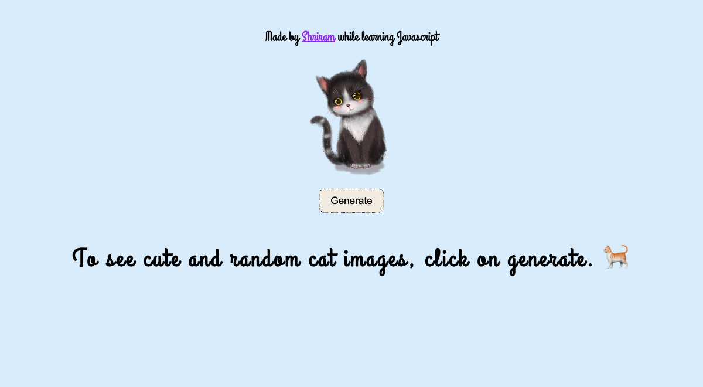

# Random cat image generator using Javascript

- This is a random cat image generator application, made using HTML, CSS and Javascript
- Generates cat images on click of button.

## Screenshot

## Built with

- Javascript
- Semantic HTML5 markup
- CSS custom properties
- Flexbox

## What I learned
- Learned how to fetch data from [theCatApi](https://thecatapi.com/)

## Time taken
- It took me around 1 hours to built this website from scratch.

## Links
- [live demo](https://cat-random-images.netlify.app/)
- [source](https://github.com/RAM844/Cat-image-generator-)

## Contact me
- GitHub - [@RAM844](https://github.com/RAM844)
- Twitter - [@ShriramBalaji7](https://www.twitter.com/ShriramBalaji7)

